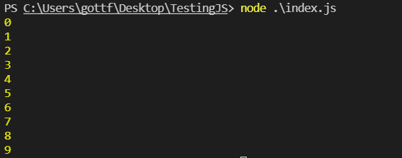
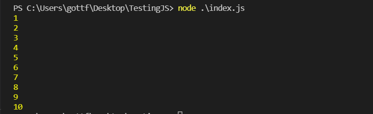

# Loops (Bucles)
Los bucles son también unas herramientas muy importantes para los programadores. Utilizando bucles puedes automatizar ciertos aspectos de tu código.

## While
Este bucle sirve para hacer algo mientras una expressión dentro de él sea "true". También se podría hacer un loop infinito utilizando el siguiente código.

```js


while(true){
    console.log("Hola")
    /*
    Este es un código peligroso, si se ejecuta no parará nunca a no ser que pares el proceso utilizando control+c en la terminal o apagues el ordenador. Si lo ejecutas, tu ordenador comenzará a gastar muchos recursos y saldrán muchos "Hola".
    */
}


let variable = 0;
while(variable < 10){
    console.log(variable)
    variable = variable + 1;
}
/*
Este código contaría hasta 9 como se puede ver más abajo. ¿Sabes porque?
*/


```



En el caso del "while" se debe destacar que primero comprueba el valor y después hace la acción, esto es para diferenciarlo del siguiente bucle. 

## Do X While
Este bucle es muy similar, pero en lugar de comprobar el valor antes, ejecuta código antes y después ya mira el valor. Para comprobarlo, podemos traducir el código anterior que mostraba números hasta el 9 y ver que pasa.
```js
let variable = 0;
do {
    variable++;
    console.log(variable);
} while (variable < 10);

```



## Foreach
Este bucle es completamente diferente a los previamente mencionados. Aquí volverá el tipo de variable array, que como podemos recordar, es una lista de otras variables. Todos los arrays tienen dentro de ellos una función que como la .log() nos permite hacer algo especial. Esta función se apoda "foreach" que se traduce más o menos como "por cada uno", como su nombre indica, esta función nos permite ejecutar código para todos los elementos que tiene esta lista de valores y obtener cada elemento en una variable que queramos dentro de la función.
Entiendo que este texto no es siempre obvio por lo tanto los siguientes ejemplos pueden resultar útiles.

```js
let lista = ["Juan", "María", "Pablo", "Eduardo"];

lista.forEach(amigo => {
    console.log(amigo);
});

```
// TODO


## For

[< Anterior](./9-Puertas-Lógicas.md) [Siguiente >](./11-Comentarios.md)