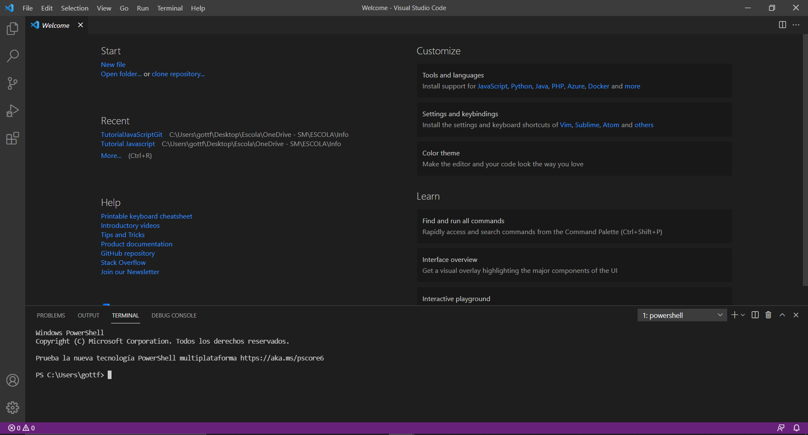

# Preparación de tu Equipo
Cómo hemos mencionado anteriormente, programar se está extendiendo y ¡ha llegado a estar a unos clics de cada usuario!

## Programas necesarios
### CMD, PowerShell, Shell...
Se necesita algún tipo de terminal ya que todos los comandos para ejecutar o instalar módulos se utiliza una consola. ¡Pero no te asustes! Los comandos son siempre los mismos y son muy sencillos. Tu sistema operativo (Windows, MacOS...) ya debería integrar una terminal que funcione.

En el caso de que no sepas cómo ejecutar tu terminal, puedes seguir los siguientes tutoriales:
- [Windows](https://www.muycomputer.com/2018/10/25/consola-de-windows-guia/)
- [MacOS](https://macpaw.com/how-to/use-terminal-on-mac)

### NodeJS
Este programa es el lenguaje de programación en sí. Se puede descargar en:
https://nodejs.org/en/download/

Tendrás diversas opciones, normalmente recomiendo la LTS y obviamente el sistema operativo que tengas.
LTS es la abreviatura de Long Term Support. Esto significa que esta versión se mantendrá durante varios años y es estable.

Al descargar el archivo se debe ejecutar y configurar acorde con tus preferencias.

Para validar la instalación debes ejecutar el siguiente comando:
`node -v`
En el caso que se haya instalado correctamente, debería salir algo similar a esto:
`v14.16.0`
Si el número de versión cambia no importa, pero es importante que no te diga comando desconocido o algún error similar. En el caso de que esto pase, puedes intentar reiniciar tu equipo para ver si se soluciona. Si no se soluciona intenta completar la instalación.
### NPM
NPM es el programa encargado de instalar los módulos de JavaScript. Cuando instalas NodeJS también se instala NPM automáticamente.

¡Con estas simples herramientas ya se puede comenzar a programar! Aunque si hay cosas opcionales que puedes tener una mejor experiencia de programación.

### Editor de Código
Para editar tu código se puede utilizar el programa "Notepad" que simplemente edita archivos. Es una especie de Word pero no se puede utilizar ningún estilo de texto. Pero estos no ofrecen autocompletación de código cómo otros programas que puede ayudar tanto a los principiantes como a los más avanzados.

Personalmente recomiendo programas cómo [Visual Studio Code](https://code.visualstudio.com/) por Microsoft, pero yo utilizo [Jetbrains IDE](https://jetbrains.com) [(Webstorm)](https://www.jetbrains.com/webstorm/) porque es más completo. El problema de Jetbrains IDE es que vale dinero, aunque si eres un estudiante lo puedes obtener gratis.

Una vez tengamos todas estas herramientas instaladas en nuestro ordenador ya podríamos empezar a programar JavaScript (Server Sided).

Así se vería el editor de texto Visual Studio Code, este programa tiene una terminal integrada por lo tanto no vas a tener que utilizar la integrada en tu sistema operativo. Esta se puede activar seleccionando el botón de terminal en la barra superior.

[< Anterior](./2-JavaScript.md) [Siguiente >](./4-Preparación.md)