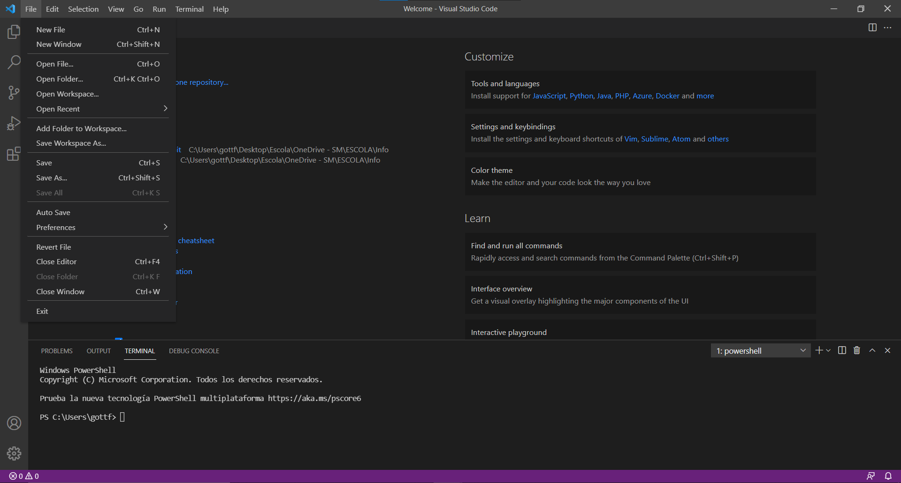
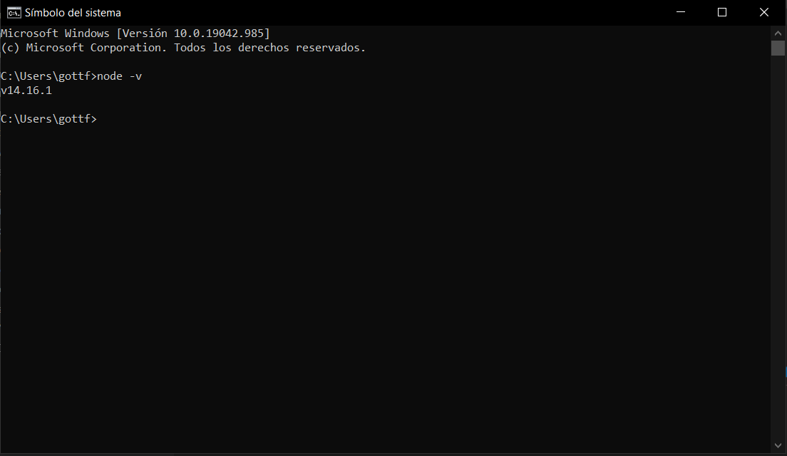
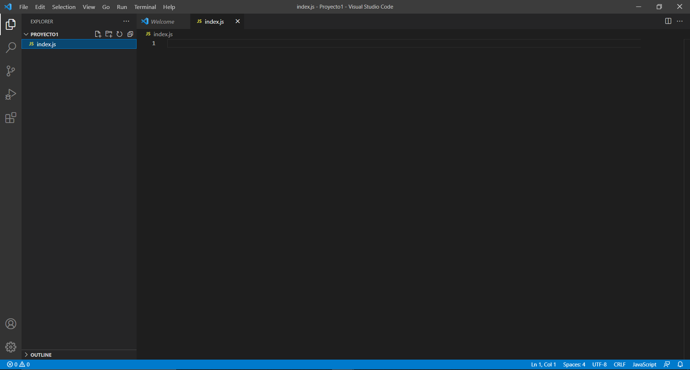

# Primer Código
Una vez tenemos nuestra máquina preparada para programar podemos comenzar. Debemos crear una nueva carpeta con cualquier nombre y abrirla seleccionandola al clicar en File > Open Folder. Esto abrirá una nueva ventana con todos los archivos de la carpeta (de momento ninguno).




Después podemos proceder a crear nuestro primer archivo `.js`. Esta extensión es caraterística de scripts en javascript. Normalmente al archivo del proyecto principal se le suele dar el nombre index.js. El archivo se puede crear en el panel izquierdo, en la parte superior y lo podemos abrir seguidamente.


Ahora ya estamos completamente preparados para programar nuestro primer código en JavaScript. Como hemos mencionado anteriormente, normalmente este código suele ser "Hello World" y este caso no será diferente.
Si ponemos esta línea de código en el archivo de `index.js` y ejecutamos el comando `node index.js` podremos ver como imprime "Hello World" en la consola.
```js
console.log("Hello World");
``` 



El comando `node` es muy importante, con este comando se ejecutan los archivos por lo tanto es un comando que se debe recordar.
En este código utilizamos la función "log" de la variable consola, que representa tu consola. Las funciones de programación son muy similares a las matemáticas, en este caso, lo que se ponga dentro de la función será el texto que se ponga en la consola.

El texto de la función se puede cambiar por lo que quieras, pero debe estar entre comillas ya que si no, el código no puede diferenciar eso de una variable, las cuales estudiaremos posteriormente.

[< Anterior](./3-Preparación.md) [Siguiente >](./5-Variables-.md)